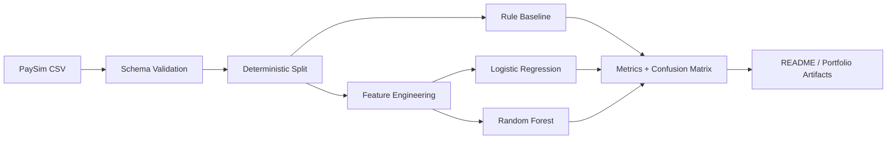
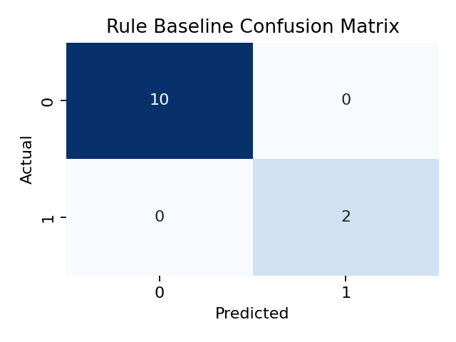

# PaySim Fraud Detection

Rule-based baselines vs lightweight machine learning on the PaySim synthetic transaction dataset.

> A portfolio-ready fraud-detection case study focused on reproducibility, interpretability, and honest evaluation on an imbalanced classification task.

## Highlights

- Rebuilt a notebook-first repo into a code-first ML project with reusable modules under `src/`
- Preserved a strong domain baseline: balance-emptying fraud rules for `TRANSFER` and `CASH_OUT`
- Compared rule heuristics against Logistic Regression and Random Forest
- Added deterministic data splits, automated tests, exported metrics, and figure artifacts

## Project Snapshot

| Area | What This Repo Shows |
| --- | --- |
| Problem framing | Fraud detection on highly imbalanced financial-transaction data |
| Baselines | Interpretable rule-based heuristics |
| ML models | Logistic Regression, Random Forest |
| Evaluation | Precision, Recall, F1, PR-AUC, confusion matrix |
| Engineering | Tested pipeline, reproducible local runs, modular code |

## Pipeline



## Dataset

- Source: [PaySim on Kaggle](https://www.kaggle.com/datasets/ealaxi/paysim1)
- Expected local path: `data/raw/PS_20174392719_1491204439457_log.csv`
- The full dataset is not committed to this repository

## Rule Baseline

The strongest interpretable baseline in this project flags transactions where:

- `type == TRANSFER` and `amount == oldbalanceOrg`
- `type == CASH_OUT` and `amount == oldbalanceOrg`

This rule comes from the original exploratory notebook and is now formalized in [baseline_rules.py](src/rules/baseline_rules.py).

## Latest Local Reference Run

Reference run completed on `2026-03-25` using a stratified sample of `200,000` rows from the public PaySim CSV.

| Method | Precision | Recall | F1 | PR-AUC |
| --- | ---: | ---: | ---: | ---: |
| Rule baseline | 1.000 | 0.981 | 0.990 | 0.981 |
| Logistic Regression | 1.000 | 1.000 | 1.000 | 1.000 |
| Random Forest | 1.000 | 1.000 | 1.000 | 1.000 |

Reference artifacts:

- Metrics: [model_comparison.json](reports/metrics/paysim_200k/model_comparison.json)
- Figures:
  - [rule_baseline_confusion_matrix.png](reports/figures/rule_baseline_confusion_matrix.png)
  - [logistic_regression_confusion_matrix.png](reports/figures/logistic_regression_confusion_matrix.png)
  - [random_forest_confusion_matrix.png](reports/figures/random_forest_confusion_matrix.png)

Preview:



## Why The Scores Are So High

PaySim is a synthetic dataset with strong balance-driven fraud structure. That makes it useful for learning and benchmarking, but it also means very high scores should be interpreted cautiously.

This repo tries to stay honest about that:

- the rule baseline is reported alongside ML models
- metrics focus on imbalance-aware evaluation instead of raw accuracy
- the README explicitly calls out dataset limitations

## Repository Layout

```text
.
|-- README.md
|-- requirements.txt
|-- pytest.ini
|-- data/
|   |-- raw/
|   `-- processed/
|-- docs/
|   `-- resume-highlights.md
|-- notebooks/
|   |-- 01_dataset_overview.ipynb
|   |-- 02_rule_based_baseline.ipynb
|   |-- 03_model_comparison.ipynb
|   `-- legacy/
|-- reports/
|   |-- figures/
|   `-- metrics/
|-- src/
|   |-- config.py
|   |-- data/
|   |-- features/
|   |-- models/
|   |-- rules/
|   `-- utils/
`-- tests/
```

## Quick Start

Create a virtual environment and install dependencies:

```powershell
python -m venv .venv
.\.venv\Scripts\Activate.ps1
python -m pip install -r requirements.txt
```

Download the Kaggle CSV and place it at:

```text
data/raw/PS_20174392719_1491204439457_log.csv
```

Run tests:

```powershell
.\.venv\Scripts\python.exe -m pytest tests -q
```

Run a full local experiment:

```powershell
.\.venv\Scripts\python.exe -m src.models.train --input data/raw/PS_20174392719_1491204439457_log.csv
```

Run a faster sample experiment:

```powershell
.\.venv\Scripts\python.exe -m src.models.train --input data/raw/PS_20174392719_1491204439457_log.csv --sample-size 50000 --output-dir reports/metrics/smoke
```

## Notebooks

The notebooks are supporting material, not the source of truth:

- [01_dataset_overview.ipynb](notebooks/01_dataset_overview.ipynb): quick dataset overview
- [02_rule_based_baseline.ipynb](notebooks/02_rule_based_baseline.ipynb): interpretable fraud heuristics
- [03_model_comparison.ipynb](notebooks/03_model_comparison.ipynb): code-first experiment walkthrough
- [legacy/01_original_rule_discovery.ipynb](notebooks/legacy/01_original_rule_discovery.ipynb): original analysis notebook kept for history

## Testing

The test suite covers:

- schema validation
- deterministic splitting
- rule-baseline correctness
- feature construction
- metric computation
- training smoke runs

Run:

```powershell
.\.venv\Scripts\python.exe -m pytest tests -q
```

## Limitations

- This is not a production fraud platform.
- The model family is intentionally small.
- Final benchmark values depend on the exact local dataset run and sample size.
- PaySim is synthetic, so strong performance may not transfer directly to real-world financial systems.
- Balance-related fields are highly informative in this dataset, so leakage review and robustness checks matter in any real extension.

## Resume Notes

Short CV bullets are available in [resume-highlights.md](docs/resume-highlights.md).
